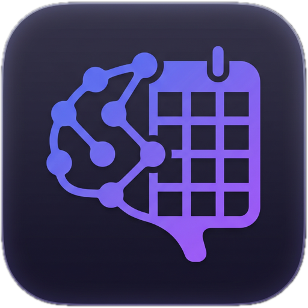

<p align="center">
  
  <h1 align="center">Cortex</h1>
</p>

A focused daily planner built as a native macOS desktop app. Cortex helps you capture tasks, schedule your week, visualise priorities with an Eisenhower matrix, and time-block your day — all in one place.

---

## Features

### Brain Dump
Capture everything on your mind without worrying about where it belongs. The Brain Dump sidebar is a frictionless inbox: type a task, hit Enter, and it lands in your backlog. From there you can drag it anywhere — a day column, an Eisenhower quadrant, or a timebox slot.

### Weekly Timeline
A horizontal 7-day view with a column per day. Drag tasks from the Brain Dump onto any day. Click **Focus** on today's header to switch to the Today view. Navigate weeks with the prev/next arrows, or jump back to the current week with the **Today** button.

### Today / Focus View
Three panels side by side:
- **Task list** (left) — all of today's tasks. Type to add, drag to organise.
- **Eisenhower Matrix** (centre) — four quadrants (Do First, Schedule, Delegate, Eliminate) that help you triage by urgency and importance. Drag any task from the list into a quadrant.
- **Timebox** (right) — a time-grid from 06:00 to 24:00 with 15-minute resolution. Drag tasks onto slots to schedule them. Resize blocks by dragging their bottom edge.

### Eisenhower Matrix
- **Do First** — Urgent & Important
- **Schedule** — Important, Not Urgent
- **Delegate** — Urgent, Not Important
- **Eliminate** — Neither

Dropping a task into a quadrant creates a copy inside the matrix. The ✕ button on a matrix card removes it from the quadrant only.

### Timebox
- Drag any task from Brain Dump or Today list onto a time slot — snaps to **15-minute intervals**.
- Blocks show the task title and time range.
- Resize a block by dragging its bottom handle (also snaps to 15 min).
- The current-time indicator (red line) auto-scrolls into view on open.
- ✕ on a block removes it from the timebox only.
- Supports a separate date per-day; navigate with prev/next arrows or jump to Today.

### Task Detail Panel
Click any task title to open a slide-in detail panel:
- Edit title inline
- Set a due date displayed in your preferred date format with an overdue/upcoming badge
- Log estimated time (`1h 30m`, `45m`, `2h`)
- Assign priority (Low / Medium / High)
- Tag with a colour label (create labels on the fly)
- Write free-form notes
- See which timebox slot the task occupies

### Labels
Type a label name in the label picker, pick a colour from the preset swatches, and hit **Create**. Labels appear as coloured dots on task cards and influence the colour of timebox blocks.

---

## Settings

Open settings via the **⚙** icon (or press `,`).

### General
| Setting | Options | Default |
|---|---|---|
| Language | English / Türkçe | English |
| Start of week | Monday / Sunday | Monday |
| Default view | Week / Today | Week |
| Time format | 24h / 12h | 24h |
| Date format | DD/MM/YYYY / MM/DD/YYYY / YYYY-MM-DD | DD/MM/YYYY |

### Appearance
| Setting | Options | Default |
|---|---|---|
| Theme | System / Light / Dark | System |
| Accent colour | Indigo, Blue, Cyan, Emerald, Rose, Orange, Pink, Slate | Indigo |

### Shortcuts
Overview of all single-key shortcuts (see table below).

### Update
Manually check for a new version and install it in-app without going to the browser.

All settings persist across sessions.

---

## Keyboard Shortcuts

| Key | Action |
|---|---|
| `C` | New task (focuses the Brain Dump input) |
| `V` | Toggle between Week and Today view |
| `B` | Toggle Brain Dump sidebar |
| `T` | Toggle Timebox panel |
| `,` | Open settings |
| `Esc` | Close detail panel / settings / blur input |

> Shortcuts fire only when no text input is focused.

---

## Auto-Update

Cortex checks for updates on launch and every time the app is focused after being in the background. When an update is available, a banner appears in the bottom-right corner. You can also check manually via **Settings → Update**.

### macOS Gatekeeper Warning

If you see *"Cortex is damaged and can't be opened"* after downloading, run this in Terminal:

```
xattr -dr com.apple.quarantine /Applications/Cortex.app
```

This is expected for apps not signed with an Apple Developer certificate.

---

## Drag & Drop Rules

| Source | Valid Drop Targets |
|---|---|
| Brain Dump task | Day column, Eisenhower quadrant, Timebox slot, Brain Dump (unschedule) |
| Today list task | Eisenhower quadrant, Timebox slot |
| Eisenhower card (`eis::`) | Other Eisenhower quadrants only |
| Timebox block (`tb::`) | Other Timebox slots only |

---

## Tech Stack

| Layer | Technology |
|---|---|
| Desktop shell | [Tauri 2](https://tauri.app) (Rust) |
| UI framework | [React 19](https://react.dev) + [TypeScript](https://www.typescriptlang.org) |
| Build tool | [Vite 7](https://vitejs.dev) |
| Styling | [Tailwind CSS v4](https://tailwindcss.com) |
| State management | [Zustand](https://zustand-demo.pmnd.rs) with `persist` middleware |
| Drag & drop | [@dnd-kit/core](https://dndkit.com) |
| Animations | [Framer Motion](https://www.framer.com/motion) |
| Date utilities | [date-fns](https://date-fns.org) |
| Database | SQLite via `tauri-plugin-sql` |
| Auto-update | `tauri-plugin-updater` + `tauri-plugin-process` |
| i18n | Custom lightweight translation system + date-fns locales |

---

## Project Structure

```
src/
├── components/
│   ├── brain-dump/       # BrainDump, TaskItem, TaskInput, TaskDetailPanel
│   ├── common/           # LabelPicker, PriorityPicker
│   ├── eisenhower/       # EisenhowerMatrix, Quadrant
│   ├── layout/           # AppShell, Header, SettingsButton
│   ├── settings/         # SettingsPanel (modal)
│   ├── timebox/          # Timebox, TimeboxBlock, TimeSlot
│   ├── today/            # TodayFocus, TodayTaskList
│   ├── updater/          # UpdateBanner
│   └── weekly/           # WeeklyTimeline, WeekNav, DayColumn
├── hooks/
│   ├── useDateLocale.ts  # Returns date-fns locale based on language setting
│   ├── useDragDrop.ts    # Centralised drag-end handler
│   ├── useIsDark.ts      # Reactive dark-mode detector
│   ├── useT.ts           # Translation hook
│   └── useUpdater.ts     # Auto-update check + install logic
├── i18n/
│   └── index.ts          # EN / TR translation dictionaries
├── store/
│   ├── generalStore.ts   # Language, week start, default view, time/date format
│   ├── labelStore.ts     # User-defined labels
│   ├── taskStore.ts      # Tasks, view state, navigation, today refresh
│   └── themeStore.ts     # Theme, accent colour, CSS variable application
├── types/
│   └── index.ts
└── lib/
    └── db.ts             # Tauri SQLite helpers
```

---

## Development

### Prerequisites
- [Node.js](https://nodejs.org) ≥ 20
- [Rust](https://www.rust-lang.org/tools/install) + `cargo`
- [pnpm](https://pnpm.io)

```bash
# Install dependencies
pnpm install

# Run in development (hot-reload)
pnpm tauri dev

# Build for production
pnpm tauri build
```

The Vite dev server runs on `http://localhost:1420`.

---

## License

MIT
